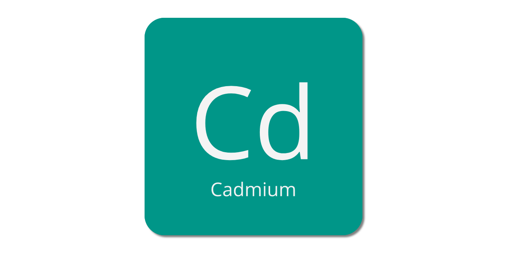

Cadmium is a Natural Language Processing (NLP) library for Crystal. Included are classes and modules for tokenizing, inflecting, stemming, and creating n-grams with much more to come.

For full API documentation check out [the docs](https://cadmiumcr.github.io/cadmium/).

For more complete and up to date information about specific parts of Cadmium, check out each relevant shard repository.


| Shard name                                                   | Description                                                  |
| ------------------------------------------------------------ | ------------------------------------------------------------ |
| [cadmium_tokenizer](https://github.com/cadmiumcr/tokenizer)  | Contains several types of string tokenizers                  |
| [cadmium_stemmer](https://github.com/cadmiumcr/stemmer)      | Contains a Porter stemmer, useful to get the stems of english words |
| [cadmium_ngrams](https://github.com/cadmiumcr/ngrams)        | Contains methods to obtain unigram, bigrams, trigrams or ngrams from strings |
| [cadmium_classifier](https://github.com/cadmiumcr/classifier) | Contains two probabilistic classifiers used in NLP operations like language detection or POS tagging for example |
| [cadmium_readability](https://github.com/cadmiumcr/readability) | Analyzes blocks of text and determine, using various algorithms, the readability of the text. |
| [cadmium_tfidf](https://github.com/cadmiumcr/tfidf)          | Calculates the Term Frequency–Inverse Document Frequency of a corpus |
| [cadmium_glove](https://github.com/cadmiumcr/glove)          | Pure Crystal implementation of Global Vectors for Word Representations |
| [cadmium_pos_tagger](https://github.com/cadmiumcr/pos_tagger) | Tags each token of a text with its Part Of Speech category   |
| [cadmium_lemmatizer](https://github.com/cadmiumcr/lemmatizer) | Returns the lemma of each given string token                 |
| [cadmium_summarizer](https://github.com/cadmiumcr/summarizer) | Extracts the most meaningful sentences of a text to create a summary |
| [cadmium_sentiment](https://github.com/cadmiumcr/sentiment)  | Evaluates the sentiment of a text                            |
| [cadmium_distance](https://github.com/cadmiumcr/distance)    | Provides two string distance algorithms                      |
| [cadmium_transliterator](https://github.com/cadmiumcr/transliterator) | Provides the ability to transliterate UTF-8 strings into pure ASCII so that they can be safely displayed in URL slugs or file names. |
| [cadmium_phonetics](https://github.com/cadmiumcr/phonetics)  | Allows to match a string with its sound representation       |
| [cadmium_inflector](https://github.com/cadmiumcr/inflector)  | Allows to inflect english words (nouns, verbs and numbers)   |
| [cadmium_graph](https://github.com/cadmiumcr/graph)          | EdgeWeightedDigraph represents a digraph, you can add an edge, get the number vertexes, edges, get all edges and use toString to print the Digraph. |
| [cadmium_trie](https://github.com/cadmiumcr/trie)            | A [trie](https://en.wikipedia.org/wiki/Trie) is a data structure for efficiently storing and retrieving strings with identical prefixes, like "**mee**t" and "**mee**k". |
| [cadmium_wordnet](https://github.com/cadmiumcr/wordnet)      | Pure crystal implementation of Stanford NLPs WordNet         |
| [cadmium_util](https://github.com/cadmiumcr/utilities)       | A collection of useful utilities used internally in Cadmium. |
| [cadmium_language_detector](https://github.com/cadmiumcr/language_detector) | Returns the most probable language code of the analysed text. |


## Installation

Your project *should* only include the cadmium shard(s) you need.

However, in case you want to test out **all of Cadmium** in a simple way, you can install all modules of the project in a few lines.

Add this to your application's `shard.yml`:

```yaml
dependencies:
  cadmium:
    github: cadmiumcr/cadmium
    branch: master
```

## Contributing

1. Fork it ( https://github.com/cadmiumcr/cadmium/fork )
2. Create your feature branch (git checkout -b my-new-feature)
3. Commit your changes (git commit -am 'Add some feature')
4. Push to the branch (git push origin my-new-feature)
5. Create a new Pull Request

## Contributors

This project exists thanks to all the people who contribute. <a href="https://github.com/cadmiumcr/Cadmium/graphs/contributors"></a>
